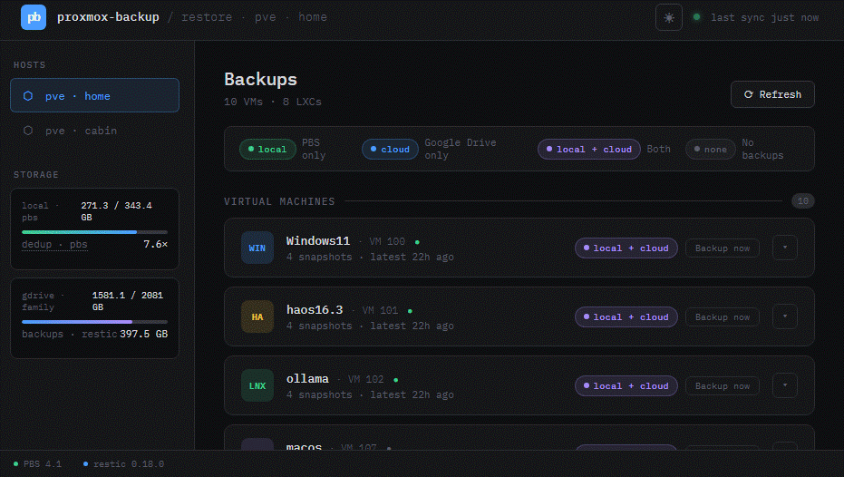

# proxmox-backup-gui

A self-hosted web dashboard for monitoring Proxmox Backup Server (PBS) and restic cloud backups.

Shows per-VM backup status, local/cloud coverage, storage usage, and historical snapshots in a clean dark UI.



> **⚠️ HOBBY PROJECT — USE AT YOUR OWN RISK**
>
> This is a personal homelab project built for fun and convenience. The code, the CI pipelines, the tests, and this README were all written with Claude Code assistance. It is not production software, has no guarantees, and comes with no support. It works on my hardware — it may or may not work on yours. If you use this and something goes wrong, that's on you.
>
> The GUI can trigger real backup and restore operations on your Proxmox host. A restore from cloud will stop PBS, overwrite your local datastore, and restart PBS. Make sure you understand what each operation does before using it.

## Relationship to proxmox-backup-restore

This GUI is designed to work alongside **[proxmox-backup-restore](https://github.com/d96moe/proxmox-backup-restore)** — a set of scripts that set up PBS local backups and restic cloud backups on a Proxmox host. If you have installed and configured that project, this GUI will work out of the box.

You can use this GUI without those scripts, but you must replicate the same environment on your PVE host (see [Prerequisites](#prerequisites) below).

## Prerequisites

The GUI LXC talks to your PVE host over both the API and SSH. The following must be in place before deploying:

### On your PVE host

| Requirement | Notes |
|---|---|
| Proxmox VE 8+ with PBS | PBS must be running with at least one datastore configured |
| PBS user or API token | Needs `Datastore.Audit`, `Datastore.Backup`, `VM.Backup` privileges |
| PVE user | `root@pam` or a user with `VM.PowerMgmt`, `Datastore.Allocate` (for restore) |
| `restic` binary | Required for cloud backup/restore features; must be in `$PATH` |
| `rclone` binary | Required for cloud features; must be in `$PATH` |
| rclone configured | A Google Drive remote (`rclone.conf`) with a remote path for the restic repo |
| restic repo initialized | `restic -r rclone:<remote>:<path> init` must have been run |
| **PVE agent** (recommended) or **SSH** | See [Agent mode vs SSH mode](#agent-mode-vs-ssh-mode) below |

### Optional (cloud features only)

Cloud backup, cloud restore, and ☁ sync are all skipped gracefully if `restic_repo` / `restic_password` are omitted from `hosts.json`. The local PBS features work without any restic/rclone setup.

### SSH key setup (if not already done)

On the GUI LXC (LXC 199):

```bash
ssh-keygen -t ed25519 -f /root/.ssh/id_ed25519 -N ""
ssh-copy-id root@<your-pve-host-ip>
```

## Features

- **Per-VM/LXC overview** — snapshot count, latest backup age, local/cloud coverage badges

- **Cloud detection** — marks PBS snapshots as cloud-covered if restic ran after them
- **Cloud-only snapshots** — shows older restic backups that no longer exist locally
- **Storage meters** — PBS local usage and Google Drive family quota
- **Backup folder size** — actual restic repo size via `rclone size`
- **Backup now** — trigger a PBS-only or PBS+cloud backup of any VM/LXC; backup type selection modal with live log
- **☁ sync** — trigger a standalone restic cloud sync from any VM card or snapshot row that has local-only coverage
- **Restore** — restore any VM/LXC from a PBS snapshot (local) or from a restic snapshot (cloud); restic operations run on the PVE host via SSH, never inside the GUI container
- **Job indicator** — running backup/restore jobs show a pulsing indicator on the VM card; click to reopen the progress modal at any time
- **Multi-host** — configure multiple PVE/PBS hosts in `hosts.json`
- **HA integration** — `/api/host/<id>/ha/sensors` endpoint for the [proxmox-backup-ha](https://github.com/d96moe/proxmox-backup-ha) integration

## Architecture

The GUI is designed to run **inside a dedicated LXC container** on your PVE host — not on the PVE host itself. This keeps it isolated from the hypervisor and makes it easy to deploy, update, and destroy independently.

```
┌─ LXC 199 (GUI container) ──────────────────────────────────┐
│                                                             │
│  agent_client.py  ◄── HTTP → pve_agent.py (port 8099)      │
│                           (runs on PVE host — handles all   │
│                            PBS, PVE, restic, rclone calls)  │
│                                                             │
│  Flask app.py ──► index.html                                │
└─────────────────────────────────────────────────────────────┘
         ▲
    browser (port 5000)
```

### Agent mode vs SSH mode

The GUI supports two modes for reaching the PVE host:

**Agent mode** (recommended): a small Flask HTTP agent (`pve_agent.py`) runs on the PVE host and exposes a local REST API. The GUI LXC calls it over plain HTTP — no SSH, no credentials for PBS/PVE stored in `hosts.json`. The agent handles all PBS, PVE, restic, and rclone calls locally. Bearer token protects the endpoint.

**SSH mode** (legacy): the GUI LXC SSHes into the PVE host to run restic/rclone commands, and calls the PBS and PVE APIs directly. Requires passwordless SSH from LXC 199 to the PVE host as root.

When `agent_url` is set in `hosts.json`, agent mode is used automatically.

> Running the GUI directly on the PVE host is technically possible but not recommended — it breaks isolation. The setup scripts only support the LXC model.

## Deployment

### First-time setup

Run on your PVE host as root:

```bash
git clone https://github.com/d96moe/proxmox-backup-gui.git /tmp/proxmox-backup-gui
cd /tmp/proxmox-backup-gui
bash setup-lxc.sh
```

This creates LXC 199 with Debian 12, installs dependencies, deploys the app and registers a systemd service. The GUI is then available at `http://192.168.0.50:5000`.

Override defaults with env vars:

```bash
LXC_ID=200 LXC_IP=192.168.0.51 bash setup-lxc.sh
```

### Updating

```bash
bash update-lxc.sh
```

Pushes updated backend + frontend files to the LXC and restarts the service.

## Configuration

Edit `/opt/proxmox-backup-gui/backend/hosts.json` on the LXC.

**Agent mode** (recommended — no SSH, no direct PBS/PVE credentials in the GUI):

```json
[
  {
    "id": "home",
    "label": "pve · home",
    "agent_url": "http://192.168.0.200:8099",
    "agent_token": "your-pbs-password"
  }
]
```

**SSH mode** (legacy):

```json
[
  {
    "id": "home",
    "label": "pve · home",
    "pbs_host": "192.168.0.200",
    "pbs_user": "backup@pbs",
    "pbs_password": "your-pbs-password",
    "pbs_datastore": "local-store",
    "pve_host": "192.168.0.200",
    "pve_user": "root@pam",
    "pve_password": "your-pve-password",
    "restic_repo": "rclone:gdrive:bu/proxmox_home",
    "restic_password": "your-restic-password"
  }
]
```

The agent token is the PBS user password — it is used as a Bearer token to authenticate requests to the agent.

## API Endpoints

| Endpoint | Description |
|----------|-------------|
| `GET /api/hosts` | List configured hosts |
| `GET /api/host/<id>/items` | VMs + LXCs with merged PBS + restic snapshots |
| `GET /api/host/<id>/storage` | PBS and Google Drive storage usage (async) |
| `GET /api/host/<id>/ha/sensors` | Flat sensor dict for Home Assistant |
| `GET /api/host/<id>/info` | PBS and restic version info |

## CI & Testing

See [ci/README.md](ci/README.md) for the full CI setup — two Jenkins pipelines (fast mock tests on every push, nightly integration tests against a real Proxmox VM).

## Restic conflict avoidance

The GUI uses `rclone lsjson locks/` to check if a restic backup is in progress before making restic calls. Locks older than 8 hours are treated as stale (from crashed backups) and ignored.

## Roadmap

- **Authentication** — login page with hashed credentials; currently the GUI is open to anyone who can reach the LXC
- **VM/LXC backup mask** — per-VM include/exclude toggles so not every container is backed up to cloud
- **Prune / retention settings** — UI for both PBS retention (`prune-backups` per storage in PVE) and restic `--keep-last / --keep-daily / --keep-weekly`; both written to PVE host config via SSH
- **Backup scheduler** — view and edit schedules for both PBS (vzdump) and restic (cloud) jobs; currently both are configured statically on the PVE host via systemd timers / cron outside the GUI
- **Delete backup (cloud)** — guided workflow to remove a specific VM's backup from the restic repo: restore full datastore → delete from PBS → re-backup → forget old snapshot. Expensive but correct given the whole-datastore restic architecture.
- **Restic prune after sync** — after a successful `☁ sync`, automatically run `restic forget --prune` according to configured retention policy; currently pruning is handled outside the GUI

## Related

- [proxmox-backup-restore](https://github.com/d96moe/proxmox-backup-restore) — PBS + restic setup and disaster recovery scripts; sets up the environment this GUI expects
- [proxmox-backup-ha](https://github.com/d96moe/proxmox-backup-ha) — Home Assistant integration using the `/api/host/<id>/ha/sensors` endpoint
