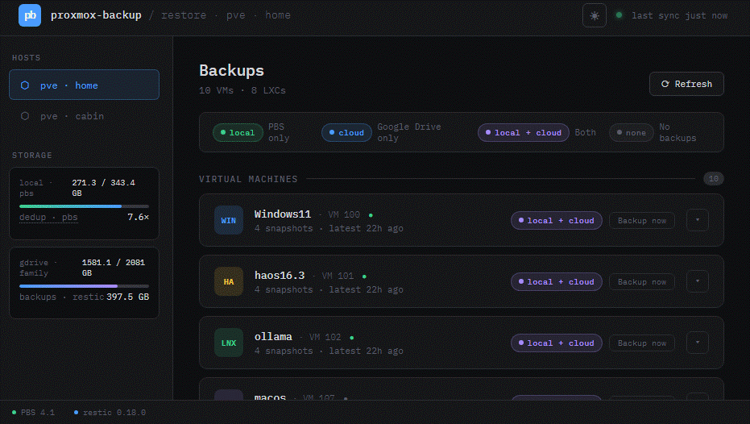

# proxmox-backup-gui

A self-hosted web dashboard for monitoring Proxmox Backup Server (PBS) and restic cloud backups.

Shows per-VM backup status, local/cloud coverage, storage usage, and historical snapshots in a clean dark UI. Includes a settings modal for retention policies, backup schedules, and VM selection — all written back to the PVE host via the agent.



> **⚠️ HOBBY PROJECT — USE AT YOUR OWN RISK**
>
> This is a personal homelab project built for fun and convenience. The code, the CI pipelines, the tests, and this README were all written with Claude Code assistance. It is not production software, has no guarantees, and comes with no support. It works on my hardware — it may or may not work on yours. If you use this and something goes wrong, that's on you.
>
> The GUI can trigger real backup and restore operations on your Proxmox host. A restore from cloud will stop PBS, overwrite your local datastore, and restart PBS. Make sure you understand what each operation does before using it.

## Relationship to proxmox-backup-restore

This GUI is designed to work alongside **[proxmox-backup-restore](https://github.com/d96moe/proxmox-backup-restore)** — a set of scripts that set up PBS local backups and restic cloud backups on a Proxmox host. If you have installed and configured that project, this GUI will work out of the box.

You can use this GUI without those scripts, but you must replicate the same environment on your PVE host (see [Prerequisites](#prerequisites) below).

## Prerequisites

| Where | Requirement | How |
|---|---|---|
| GUI LXC | Mosquitto MQTT broker | Installed by `setup-lxc.sh` |
| GUI LXC | Python 3.11 + Flask deps | Installed by `setup-lxc.sh` |
| Each PVE host | Proxmox VE 8+ with PBS | Pre-existing |
| Each PVE host | `pve_agent.py` systemd service | Installed by `setup-agent.sh` |
| Each PVE host | `restic` + `rclone` | Required for cloud features only |
| Each PVE host | rclone remote + restic repo initialized | Required for cloud features only |

Cloud backup, cloud restore, and ☁ sync are skipped gracefully if `restic_repo` / `restic_password` are left blank in the agent config. All local PBS features work without them.

## Features

- **Per-VM/LXC overview** — snapshot count, latest backup age, local/cloud coverage badges
- **Cloud detection** — marks PBS snapshots as cloud-covered if restic ran after them
- **Cloud-only snapshots** — shows older restic backups that no longer exist locally in PBS
- **Storage meters** — PBS local usage and Google Drive family quota
- **Backup now** — trigger a PBS-only or PBS+cloud backup of any VM/LXC; live log in job modal
- **☁ sync** — trigger a standalone restic cloud sync from any VM card or snapshot row
- **Restore** — restore from a PBS snapshot (local) or restic snapshot (cloud)
- **Job indicator** — running jobs show a pulsing indicator on the VM card; click to reopen progress modal
- **PBS task visibility** — running PBS operations (GC, external backup, prune) appear as clickable cards in the sidebar; click to view live log stream
- **Restic nightly log streaming** — when the nightly restic job is running the sidebar badge is clickable; opens a modal that replays existing log lines and streams new lines live via SSE until the job finishes
- **Settings modal** — editable per-host settings written back to the PVE host via agent:
  - Restic cloud retention (keep-last / keep-daily / keep-weekly / keep-monthly)
  - PBS prune policy (keep-last / keep-daily / keep-weekly / keep-monthly / keep-yearly)
  - PBS backup schedule and restic backup schedule (systemd OnCalendar)
  - VM/LXC backup selection — exclude-list (backup all, mark exclusions) or include-list (only named VMs)
- **Authentication** — login page with bcrypt-hashed credentials; role system (admin / viewer)
- **Multi-host** — monitor multiple PVE/PBS hosts simultaneously in one UI
- **Real-time updates** — browser receives live data via MQTT WebSocket; no polling
- **Home Assistant sensors** — when `mqtt_ha_host` is set in the agent config, host-level summary and storage data are forwarded to HA via MQTT Discovery; sensors appear automatically without a custom component

## Architecture

The GUI is **MQTT-driven**: the browser never polls the backend for VM/snapshot data. A lightweight agent (`pve_agent.py`) on each PVE host publishes retained MQTT messages to a Mosquitto broker co-located in LXC 199. Flask proxies those messages to the browser over a WebSocket at `/mqtt-ws` — the browser connects to Flask only on one port, never to Mosquitto directly. Full data appears in < 200 ms on page load; live updates arrive as agents publish. There is no REST polling path for VM/snapshot data.

```
PVE host (home, 192.168.0.200)
  └── pve_agent.py  ──MQTT──► Mosquitto :1883 ◄──── pve_agent.py (Pi5 / cabin)
                                   │
                               LXC 199
                          ┌────────┴────────┐
                          │  Flask :5000     │  ◄── browser (HTTP + WebSocket /mqtt-ws)
                          │  (MQTT proxy)    │
                          └─────────────────┘
```

### MQTT topics

Each agent publishes under `proxmox/<mqtt_hostname>/`. The GUI subscribes to `proxmox/+/#` (all hosts, all topics) and filters by `currentHost` in `_onMessage`.

#### Published by agent → received by browser

| Topic suffix | Retained | Content |
|---|---|---|
| `agent/status` | yes | `{"status": "online"}` — LWT; broker publishes `"offline"` on disconnect |
| `state/ready` | yes | `{"ts": …, "pve_ok": true, "pbs_ok": true}` — agent health heartbeat |
| `vms/index` | yes | Sorted list of all VMIDs: `["101", "200", "301"]` |
| `vm/<id>/meta` | yes | `{vmid, name, type, status, os, template, in_pve}` |
| `vm/<id>/pbs` | yes | `{snapshots: [{backup_time, date, local, cloud, incremental, size, size_bytes, restic_id, restic_short_id}]}` — cloud-only entries have `local=false, cloud=true` |
| `vm/<id>/restic` | yes | `{snapshots: [{id, short_id, time, covers: [{vmid, pbs_time, pbs_date, local, cloud}]}]}` — per-VM view (legacy/aggregation) |
| `restic/snapshots` | yes | Authoritative flat list of **all** restic snapshots in the repo: `[{id, short_id, ts, size_bytes, covers: [{type, vmid, pbs_time}]}]`. The GUI reads this (not the per-VM aggregation) so a forgotten snapshot can never be resurrected from a stale per-VM topic |
| `vm/<id>/backup/progress` | no | `{line: "…"}` — live log lines during a backup job |
| `ops/<op_id>/status` | yes | `running` / `ok` / `failed` — operation lifecycle |
| `ops/<op_id>/log` | no | live op log lines; `__done__` terminator |
| `storage` | yes | `{local_used, local_total, cloud_used, cloud_total, cloud_quota_used, dedup_factor}` |
| `summary` | yes | `{vm_count, protected_vm_count, unprotected_count, all_protected, last_pbs_backup_iso, last_pbs_backup_age_h, restic_snapshot_count, last_restic_backup_iso, last_restic_backup_age_h}` — host-level protection summary; also forwarded to HA MQTT if configured |
| `info` | yes | `{pbs: "4.1.4", pve: "9.0.0", restic: "0.18.0"}` — version strings |
| `schedules` | yes | `{pbs_jobs, pbs_running, restic_next, restic_running, pbs_retention, restic_retention}` |
| `settings` | yes | `{retention, pbs_schedule, restic_schedule, vm_selection, pbs_prune}` — current host settings |
| `connection` | yes | agent connection config with **passwords redacted** |
| `pbs/tasks` | yes | all recent PBS tasks (GC, backup, prune, verify) |
| `pbs/tasks/running` | yes | running subset of `pbs/tasks`; polled every 5 s so brief GC/backup tasks are caught |
| `pbs/tasks/<upid>/log` | no | PBS task log lines (replayed on demand via `cmd/replay_pbs_log`); each line is `json.dumps(line)`, terminated by `{"done": true}` |
| `restic/log` | no | restic nightly log lines (replayed via `cmd/replay_restic_log`); `__done__` terminator |
| `job/<corr_id>/ack` | no | `{op_id: "…"}` on success, or `{error, code}` on rejection — correlation-ID response after the agent accepts/rejects a command |

#### Published by browser → received by agent

| Topic suffix | Content |
|---|---|
| `cmd/rescan` | `{}` — request a full rescan and republish |
| `cmd/backup` | `{vmid, vmtype, restic, corr_id}` — PBS backup (optionally +restic cloud) |
| `cmd/backup-restic` | `{vmid, corr_id}` — standalone restic cloud sync |
| `cmd/restore` | `{vmid, vmtype, backup_time, source, backup_after, corr_id}` — restore from PBS or cloud |
| `cmd/restore-datastore` | `{corr_id}` — whole-datastore self-restore from restic |
| `cmd/delete` | `{vmid, vmtype, backup_time, scope, restic_id, corr_id}` — delete a snapshot (`scope`: `pbs` / `cloud` / `both`) |
| `cmd/delete-all` | `{vmid, vmtype, corr_id}` — delete all snapshots for a VM |
| `cmd/settings` | `{retention, pbs_schedule, restic_schedule, vm_selection, pbs_prune, corr_id}` — write settings |
| `cmd/connection` | `{…credentials…, corr_id}` — write agent connection config |
| `cmd/replay_pbs_log` | `{upid}` — replay a PBS task log to `pbs/tasks/<upid>/log` |
| `cmd/replay_restic_log` | `{}` — replay the restic nightly log to `restic/log` |
| `cmd/replay_op_log` | `{op_id}` — replay an op log to `ops/<op_id>/log` |

Every mutating command carries a `corr_id`; the agent answers on `job/<corr_id>/ack` with the `op_id` (success) or `{error, code}` (rejection), so the browser can open the right job modal or surface the error.

> **`mqtt_hostname` must match the `id` field in `hosts.json`.**  
> If the agent's `mqtt_hostname` is different (e.g. the OS hostname), the GUI shows "Connecting…" forever. Set `mqtt_hostname` explicitly in the agent's `config.json` and verify with `journalctl -u pve-agent` on the PVE host.

### Cache consistency

Retained MQTT topics are an eventually-consistent mirror of the agent's view of PBS + restic. Three measures keep that mirror from showing stale "ghosts" (e.g. a snapshot that was just forgotten):

1. **Synchronous rescan before "done".** After a mutating op (backup/restore/delete), the agent re-scans and republishes the affected state *before* it publishes `ops/<op_id>/status=done`, on the same MQTT connection. A client that reacts to `done` is guaranteed to read fresh state.
2. **Serialized scans + forced republish.** `_scan_restic` / `_scan_pve_pbs` hold a per-scan lock across read **and** publish, so a slow scan that read pre-mutation state can never clobber a post-mutation scan (last-writer-wins). After a restic mutation the agent also force-republishes `restic/snapshots` (clearing the change-hash) so a downstream cache that missed an earlier message is corrected.
3. **Authoritative read, no resurrection.** The GUI reads the flat `restic/snapshots` topic; the per-VM aggregation and the backend's sticky cache are only consulted when that topic is genuinely *absent* — never when it is present-but-empty, so a fully-forgotten snapshot stays gone.

## Installation

All scripts run as **root on the PVE host**. The common case is one PVE host running both the GUI (in an LXC) and the agent.

### Step 1 — Clone the repo (PVE host)

```bash
git clone https://github.com/d96moe/proxmox-backup-gui.git /tmp/proxmox-backup-gui
cd /tmp/proxmox-backup-gui
```

### Step 2 — Install the agent (each PVE host)

Run on every PVE host you want to monitor. Start here so the agent token is ready for Step 3.

```bash
bash setup-agent.sh
```

The script prompts for:
- **Mosquitto broker IP** — IP of the LXC that will run the GUI (created in Step 3). If the GUI runs on this same PVE host, use its IP. You can set this later if you don't know it yet.
- **Host ID** — a short identifier (e.g. `home`). Must match the `id` field in `hosts.json` on the GUI side.

It installs the agent to `/opt/pve-agent/`, writes a config template to `/etc/pve-agent/config.json`, and registers a `pve-agent` systemd service. At the end it prints the exact `hosts.json` snippet to paste into the GUI.

**Fill in credentials before starting the agent:**

```bash
nano /etc/pve-agent/config.json
```

Mandatory fields to fill in (everything else has sensible defaults):

| Field | Example | Notes |
|---|---|---|
| `pve_password` | `hunter2` | Root PVE password (or API token) |
| `pbs_password` | `hunter2` | PBS user password |
| `pbs_datastore` | `local-store` | Name of your PBS datastore |
| `pbs_storage_id` | `pbs-local` | PVE storage ID for PBS (`pvesm status`) |
| `pbs_datastore_path` | `/mnt/datastore/local-store` | Filesystem path to the datastore |

Then start it:

```bash
systemctl start pve-agent
journalctl -u pve-agent -f   # should show "Agent ready" within a few seconds
```

### Step 3 — Install the GUI (LXC on PVE host)

```bash
bash setup-lxc.sh
```

Creates LXC 199 with Debian 12, installs Mosquitto + Flask, creates an initial admin user, and starts the service. At the end it asks for the first host's details — if the agent from Step 2 is already running on this host, the token is detected automatically.

Override defaults with env vars:

```bash
LXC_ID=200 LXC_IP=192.168.0.51/24 LXC_GW=192.168.0.1 bash setup-lxc.sh
```

### Step 4 — Open the GUI

```
http://<LXC-IP>:5000
```

Login with the credentials printed by `setup-lxc.sh`. VM cards appear as soon as the agent publishes its first scan (within ~10 seconds of the agent starting).

### Adding more hosts

For each additional PVE host, run `setup-agent.sh` on that host, then add the snippet it prints to `hosts.json` inside the GUI LXC:

```bash
pct enter 199
nano /opt/proxmox-backup-gui/backend/hosts.json   # paste the new host entry
systemctl restart proxmox-backup-gui
exit
```

### Adding users

```bash
bash add-user.sh alice           # viewer (read-only)
bash add-user.sh bob admin       # admin (full access)
```

### Updating

```bash
bash update-lxc.sh               # pushes updated files into LXC 199 and restarts
```

Re-run `setup-agent.sh` on each PVE host to update the agent files.

## Configuration

### `hosts.json`

Edit `backend/hosts.json` in your GUI install directory:

```json
[
  {
    "id": "home",
    "label": "pve · home"
  },
  {
    "id": "cabin",
    "label": "pve · cabin"
  }
]
```

The `id` field **must match** `mqtt_hostname` in the agent's `config.json` on each PVE host.

> **No agent URL / token.** The GUI and the agents communicate **only over MQTT** — there is no REST API between them anymore (the old `agent_url` / `agent_token` fields are gone). Each agent publishes to the shared Mosquitto broker (co-located with the GUI in LXC 199, reached by the GUI at `MQTT_BROKER_HOST`, default `localhost:1883`); the browser talks to Flask over HTTP + the `/mqtt-ws` WebSocket. All PVE/PBS/restic credentials live in each agent's own `config.json`. If your broker requires authentication, set `mqtt_user` / `mqtt_password` per host.

### Agent `config.json` (on each PVE host)

`/etc/pve-agent/config.json`:

```json
{
  "pve_url":          "https://192.168.0.200:8006",
  "pve_user":         "root@pam",
  "pve_password":     "your-pve-password",
  "pbs_url":          "https://192.168.0.200:8007",
  "pbs_user":         "backup@pbs",
  "pbs_password":     "your-pbs-password",
  "pbs_datastore":    "local-store",
  "pbs_storage_id":   "pbs-local",
  "pbs_datastore_path": "/mnt/pbs",
  "restic_repo":      "rclone:gdrive:bu/proxmox_home",
  "restic_password":  "your-restic-password",
  "restic_env":       { "RCLONE_CONFIG": "/root/.config/rclone/rclone.conf" },
  "mqtt_host":        "192.168.0.50",
  "mqtt_port":        1883,
  "mqtt_hostname":    "home",
  "agent_token":      "your-token",
  "verify_ssl":       false,

  "mqtt_ha_host":     "192.168.0.10",
  "mqtt_ha_port":     1883,
  "mqtt_ha_user":     "ha-user",
  "mqtt_ha_password": "your-ha-mqtt-password"
}
```

> `mqtt_hostname` must match the `id` in `hosts.json`. The agent logs the effective hostname at startup — check `journalctl -u pve-agent` if the GUI shows "Connecting…".

The `mqtt_ha_*` fields are optional. When `mqtt_ha_host` is set, the agent publishes `summary` and `storage` topics to a second MQTT broker (e.g. Home Assistant's built-in broker) with MQTT Discovery prefixes, making host sensors appear automatically in Home Assistant.

## API Endpoints

These are **browser-facing** HTTP endpoints served by Flask. Read endpoints return data straight from the MQTT cache (the mirror of the agents' retained topics); write endpoints publish an MQTT command to the agent and wait for its `job/<corr_id>/ack`. There is no HTTP call from Flask to the agents — that path is entirely MQTT.

| Endpoint | Description |
|----------|-------------|
| `GET /api/hosts` | List configured hosts |
| `GET /api/host/<id>/items` | VMs + LXCs with merged PBS + restic snapshots |
| `GET /api/host/<id>/storage` | PBS and Google Drive storage usage (async) |
| `GET /api/host/<id>/ha/sensors` | Flat sensor dict for Home Assistant |
| `GET /api/host/<id>/info` | PBS and restic version info |
| `GET /api/host/<id>/settings` | Read restic retention, PBS prune policy, schedules, VM selection |
| `POST /api/host/<id>/settings` | Write any combination of the above settings to the PVE host |
| `GET /api/host/<id>/connection` | Read agent connection config (passwords redacted; admin only) |
| `POST /api/host/<id>/connection` | Write credentials to agent's config.json; empty password = unchanged (admin only) |
| `GET /api/host/<id>/pbs/tasks` | List PBS tasks (`?running=1` for running only) |
| `GET /api/host/<id>/pbs/tasks/<upid>/log` | Full log of a PBS task |
| `GET /api/host/<id>/pbs/tasks/<upid>/stream` | SSE stream of a running PBS task log |
| `GET /api/host/<id>/restic/log` | Last 500 lines of the restic nightly log + `running` bool |
| `GET /api/host/<id>/restic/log/stream` | SSE stream of the restic nightly log; emits `__done__` when the job finishes |
| `WS  /mqtt-ws` | MQTT proxy WebSocket — browser subscribes here instead of directly to Mosquitto; requires session cookie (login required) |

## CI & Testing

See [ci/README.md](ci/README.md) for the full CI setup — two Jenkins pipelines (fast mock tests on every push, nightly integration tests against a real Proxmox VM).

## Restic conflict avoidance

The GUI uses `rclone lsjson locks/` to check if a restic backup is in progress before making restic calls. Locks older than 8 hours are treated as stale (from crashed backups) and ignored.

## Roadmap

Recently shipped (previously on this list):

- ✅ **Host/connection settings** — PBS/restic credentials and schedules editable from the GUI (`settings` + `connection`), written back to the agent's `config.json`.

### A note on "delete a VM's cloud backup"

This is **inherently awkward with the whole-datastore restic model** and is *not* cleanly solvable. restic backs up the **entire PBS datastore** as one snapshot, so a single VM appears inside *many* restic snapshots (every nightly run that included it). Truly "removing just that VM from the cloud" would mean iterating over **every** restic snapshot the VM appears in and rewriting each one — expensive and error-prone.

What the GUI implements instead is the tractable subset: deleting a **cloud-only PBS snapshot** (a point-in-time of the whole store). It restores the datastore from restic → deletes that snapshot from PBS → re-backs up → forgets every restic snapshot covering that `(vmid, pbs_time)`. Because forgetting a whole-datastore restic snapshot also drops other VMs' coverage at that time, this is coarse by nature. Genuine per-VM cloud deletion would require **per-VM restic repos** — a larger change, still open.

## Related

- [proxmox-backup-restore](https://github.com/d96moe/proxmox-backup-restore) — PBS + restic setup and disaster recovery scripts; sets up the environment this GUI expects
- [proxmox-backup-ha](https://github.com/d96moe/proxmox-backup-ha) — Home Assistant integration using the `/api/host/<id>/ha/sensors` endpoint
